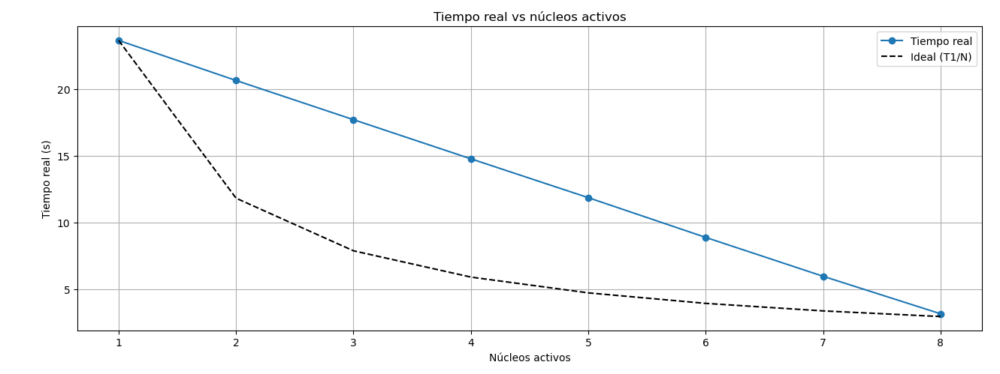
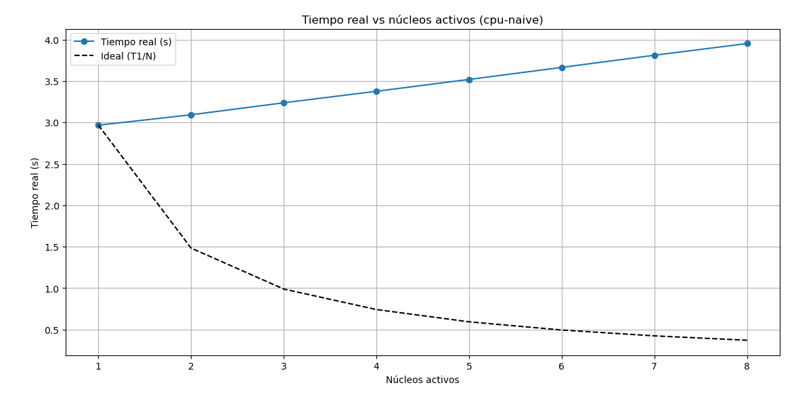
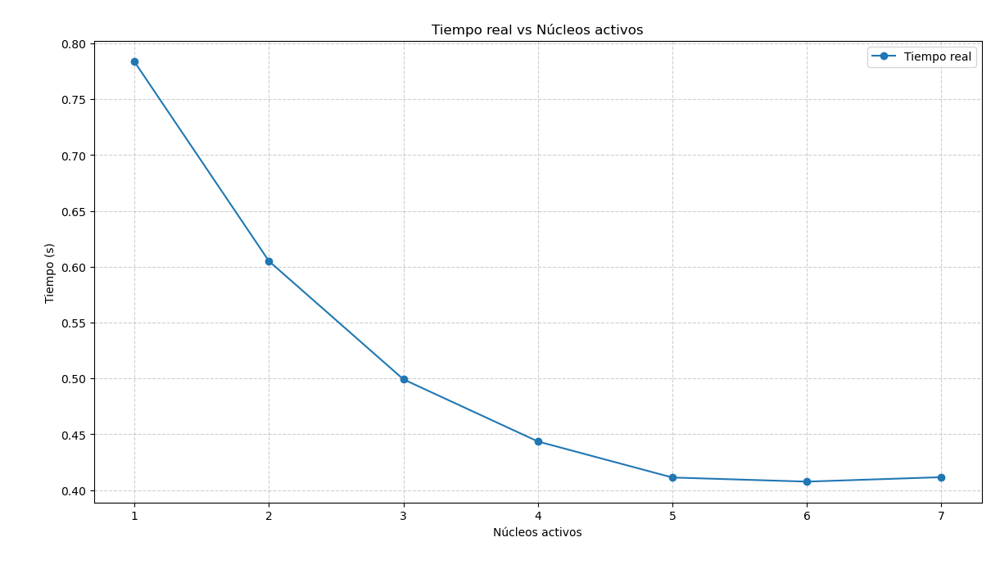
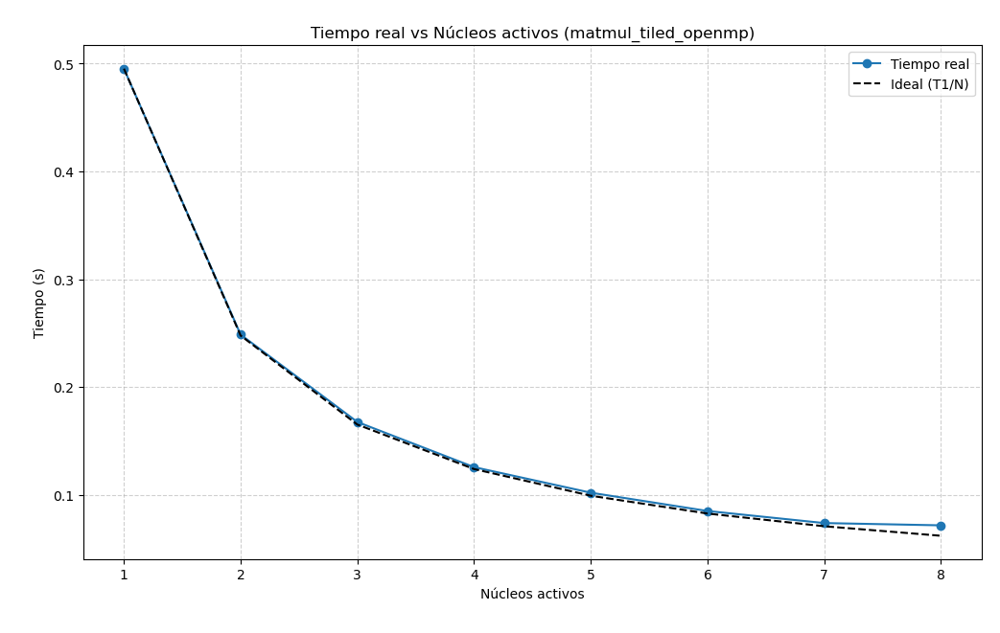

# Practica 3
Característica:
Procesador,AMD Ryzen 7 5700X 8-Core Processor
Arquitectura,x86_64
## Ejercicio A
| Núcleos activos | Tiempo real (s) | Speedup S=T1/Tn | Eficiencia E=S/N | Estim. fracción paralela (Amdahl) |
|:---:|---:|---:|---:|---:|
| 1 | 23.661 | 1.000 | 1.00 | — |
| 2 | 20.656 | 1.146 | 0.573 | 0.25 |
| 3 | 17.718 | 1.336 | 0.445 | 0.38 |
| 4 | 14.783 | 1.600 | 0.400 | 0.50 |
| 5 | 11.869 | 1.995 | 0.399 | 0.62 |
| 6 | 8.890 | 2.663 | 0.444 | 0.75 |
| 7 | 5.975 | 3.959 | 0.566 | 0.87 |
| 8 | 3.165 | 7.479 | 0.935 | 0.99 |



| Núcleos activos | Tiempo real (s) | Speedup S=T1/Tn | Eficiencia E=S/N | Estim. fracción paralela (Amdahl) |
|:---:|---:|---:|---:|---:|
| 1 | 2.967 | 1.000 | 1.00 | — |
| 2 | 3.092 | 0.960 | 0.480 | N/A (S < 1) |
| 3 | 3.237 | 0.917 | 0.306 | N/A (S < 1) |
| 4 | 3.376 | 0.879 | 0.220 | N/A (S < 1) |
| 5 | 3.519 | 0.843 | 0.169 | N/A (S < 1) |
| 6 | 3.664 | 0.810 | 0.135 | N/A (S < 1) |
| 7 | 3.811 | 0.779 | 0.111 | N/A (S < 1) |
| 8 | 3.952 | 0.751 | 0.094 | N/A (S < 1) |



Probando el modo native se nota que el kernel manda los hilos por todos lados. Al principio suena bien porque se balancea solo cuando hay varias tareas, pero al final termina haciendo un montón de cambios de contexto y la caché sufre. Por eso las latencias varían un montón y cuando la carga se pone intensa el rendimiento se cae.

Por el contrario, con cpu affinity la cosa cambia un montón. Al amarrar cada hilo a su núcleo fijo, evitas que anden migrando, las cachés L1/L2 se aprovechan al 100% y el rendimiento se vuelve superestable y rápido. Lo único malo es que si hay picos raros de carga ya no se adapta tan fácil y termina subutilizando cores si no lo configuras bien.

## Ejercicio B
Con Softmax_openmp
| Threads | Tiempo (s) | Speedup | Observación |
|:---:|---:|---:|---|
| 1 | 0.783482 | 1.00 | Línea base |
| 2 | 0.604985 | 1.29 | Mejora notable respecto a 1 hilo |
| 3 | 0.499171 | 1.57 | Ganancia adicional significativa |
| 4 | 0.443553 | 1.77 | Buen escalado hasta 4 hilos |
| 5 | 0.411306 | 1.90 | Rendimiento sigue subiendo pero menos |
| 6 | 0.407617 | 1.92 | Casi meseta; ganancias marginales |
| 7 | 0.411595 | 1.90 | Ligera regresión respecto a 6 hilos |


Con Matmul_tiled_openmp
| Threads | Tiempo (s) | Speedup | Eficiencia (%) | Observación |
|:---:|---:|---:|---:|---|
| 1 | 0.495351 | 1.00 | 100.0% | Línea base |
| 2 | 0.248549 | 1.99 | 99.5% | Casi escalado perfecto |
| 3 | 0.167513 | 2.96 | 98.7% | Muy buena eficiencia |
| 4 | 0.125619 | 3.95 | 98.8% | Escalado casi lineal |
| 5 | 0.101883 | 4.86 | 97.2% | Pequeña pérdida de eficiencia |
| 6 | 0.084904 | 5.84 | 97.3% | Rendimiento sigue mejorando |
| 7 | 0.073721 | 6.72 | 96.0% | Alta eficiencia sostenida |
| 8 | 0.071609 | 6.92 | 86.5% | Ganancia marginal; eficiencia cae |


Los resultados muestran un escalado que rinde bien hasta los 4 hilos, pero que se estanca rápidamente a partir de 5 hilos debido a que la mejora se vuelve marginal, llegando incluso a una ligera regresión en el hilo 7. Teóricamente, esto se relaciona con la Ley de Amdahl y los límites asintóticos del paralelismo, donde el programa choca con la porción secuencial y sufre por la saturación de recursos compartidos o la pérdida de eficiencia al superar el codo de la gráfica de escalamiento.

Por el contrario, la implementación con tiling mantiene un comportamiento excelente con un escalado casi lineal y eficiencias superiores al 95% hasta los 7 hilos. Esto demuestra que la técnica explota adecuadamente la localidad de memoria en los niveles de caché y reduce los costos de comunicación, cumpliendo con la consideración de mantener una alta eficiencia operativa antes de llegar al punto donde la contención de ancho de banda de memoria provoca una caída notable en el octavo hilo.

# Practica de clase 4
## Ejercicio A y B
| Característica | Biblioteca Estática (`bench-static`) | Biblioteca Dinámica (`bench-dynamic`) |
| :--- | :--- | :--- |
| **Tiempo Total** | 1,524,138.038 $\mu s$ | 5,957,752.407 $\mu s$ |
| **Tiempo de Relleno (A / B)** | $\approx 516$ ms y $520$ ms por iteración total | $\approx 1,985$ ms y $1,975$ ms por iteración total |
| **Tiempo de Suma (`add`)** | 487,797.667 $\mu s$ | 1,996,148.388 $\mu s$ |
| **Enlace y Resolución** | El código se copia directamente en el binario en tiempo de compilación. | Resuelve símbolos en tiempo de ejecución, introduciendo indirección. |
| **Rendimiento** | Muy superior al evitar sobrecargas en llamadas repetitivas dentro de bucles. | Inferior debido a la sobrecarga por indirección en la ejecución de funciones externas. |

La versión estática le gana por mucho a la dinámica porque mete el código directo en el ejecutable al compilar, quitándose de encima esa molesta indirección y resolución de símbolos en tiempo de ejecución que frena tanto a la dinámica. Aunque la dinámica es útil para compartir espacio en disco y memoria, en bucles pesados con miles de iteraciones esa sobrecarga extra se nota altísimo, haciendo que la estática sea la opción ganadora en rendimiento puro

## Historial Consola
```bash
roussel@desk:~/Desktop/practica-clase-sem4/semana 3/threading$ make
gcc -Wall -Wextra -O3 cpu-naive.c -o cpu-naive -pthread
gcc -Wall -Wextra -O3 cpu-affinity.c -o cpu-affinity -pthread
roussel@desk:~/Desktop/practica-clase-sem4/semana 3/threading$ time ./cpu-affinity
CPUs logicos disponibles: 16
Thread 2: 256.00 MB inicializados desde CPU 0
Thread 4: 256.00 MB inicializados desde CPU 0
Thread 3: 256.00 MB inicializados desde CPU 0
Thread 6: 256.00 MB inicializados desde CPU 0
Thread 0: 256.00 MB inicializados desde CPU 0
Thread 5: 256.00 MB inicializados desde CPU 0
Thread 1: 256.00 MB inicializados desde CPU 0
Thread 7: 256.00 MB inicializados desde CPU 0
Thread 0: finalizado en CPU 0
Thread 7: finalizado en CPU 0
Thread 3: finalizado en CPU 0
Thread 4: finalizado en CPU 0
Thread 2: finalizado en CPU 0
Thread 5: finalizado en CPU 0
Thread 1: finalizado en CPU 0
Thread 6: finalizado en CPU 0

real    0m23.661s
user    0m22.796s
sys     0m0.864s
roussel@desk:~/Desktop/practica-clase-sem4/semana 3/threading$ make
gcc -Wall -Wextra -O3 cpu-affinity.c -o cpu-affinity -pthread
roussel@desk:~/Desktop/practica-clase-sem4/semana 3/threading$ time ./cpu-affinity
CPUs logicos disponibles: 16
Thread 1: 256.00 MB inicializados desde CPU 1
Thread 4: 256.00 MB inicializados desde CPU 0
Thread 0: 256.00 MB inicializados desde CPU 0
Thread 2: 256.00 MB inicializados desde CPU 0
Thread 5: 256.00 MB inicializados desde CPU 0
Thread 6: 256.00 MB inicializados desde CPU 0
Thread 3: 256.00 MB inicializados desde CPU 0
Thread 7: 256.00 MB inicializados desde CPU 0
Thread 1: finalizado en CPU 1
Thread 4: finalizado en CPU 0
Thread 0: finalizado en CPU 0
Thread 2: finalizado en CPU 0
Thread 5: finalizado en CPU 0
Thread 6: finalizado en CPU 0
Thread 3: finalizado en CPU 0
Thread 7: finalizado en CPU 0

real    0m20.656s
user    0m22.718s
sys     0m0.895s
roussel@desk:~/Desktop/practica-clase-sem4/semana 3/threading$ make
make: Nothing to be done for 'all'.
roussel@desk:~/Desktop/practica-clase-sem4/semana 3/threading$ make
gcc -Wall -Wextra -O3 cpu-affinity.c -o cpu-affinity -pthread
roussel@desk:~/Desktop/practica-clase-sem4/semana 3/threading$ time ./cpu-affinity
CPUs logicos disponibles: 16
Thread 1: 256.00 MB inicializados desde CPU 1
Thread 2: 256.00 MB inicializados desde CPU 2
Thread 5: 256.00 MB inicializados desde CPU 0
Thread 4: 256.00 MB inicializados desde CPU 0
Thread 3: 256.00 MB inicializados desde CPU 0
Thread 0: 256.00 MB inicializados desde CPU 0
Thread 7: 256.00 MB inicializados desde CPU 0
Thread 6: 256.00 MB inicializados desde CPU 0
Thread 2: finalizado en CPU 2
Thread 1: finalizado en CPU 1
Thread 0: finalizado en CPU 0
Thread 3: finalizado en CPU 0
Thread 4: finalizado en CPU 0
Thread 5: finalizado en CPU 0
Thread 6: finalizado en CPU 0
Thread 7: finalizado en CPU 0

real    0m17.718s
user    0m22.733s
sys     0m0.914s
roussel@desk:~/Desktop/practica-clase-sem4/semana 3/threading$ make
gcc -Wall -Wextra -O3 cpu-affinity.c -o cpu-affinity -pthread
roussel@desk:~/Desktop/practica-clase-sem4/semana 3/threading$ time ./cpu-affinity
CPUs logicos disponibles: 16
Thread 2: 256.00 MB inicializados desde CPU 2
Thread 1: 256.00 MB inicializados desde CPU 1
Thread 3: 256.00 MB inicializados desde CPU 3
Thread 7: 256.00 MB inicializados desde CPU 0
Thread 6: 256.00 MB inicializados desde CPU 0
Thread 0: 256.00 MB inicializados desde CPU 0
Thread 4: 256.00 MB inicializados desde CPU 0
Thread 5: 256.00 MB inicializados desde CPU 0
Thread 2: finalizado en CPU 2
Thread 3: finalizado en CPU 3
Thread 1: finalizado en CPU 1
Thread 6: finalizado en CPU 0
Thread 0: finalizado en CPU 0
Thread 5: finalizado en CPU 0
Thread 4: finalizado en CPU 0
Thread 7: finalizado en CPU 0

real    0m14.783s
user    0m22.749s
sys     0m0.935s
roussel@desk:~/Desktop/practica-clase-sem4/semana 3/threading$ make
gcc -Wall -Wextra -O3 cpu-affinity.c -o cpu-affinity -pthread
roussel@desk:~/Desktop/practica-clase-sem4/semana 3/threading$ time ./cpu-affinity
CPUs logicos disponibles: 16
Thread 4: 256.00 MB inicializados desde CPU 4
Thread 3: 256.00 MB inicializados desde CPU 3
Thread 1: 256.00 MB inicializados desde CPU 1
Thread 2: 256.00 MB inicializados desde CPU 2
Thread 0: 256.00 MB inicializados desde CPU 0
Thread 5: 256.00 MB inicializados desde CPU 0
Thread 7: 256.00 MB inicializados desde CPU 0
Thread 6: 256.00 MB inicializados desde CPU 0
Thread 3: finalizado en CPU 3
Thread 4: finalizado en CPU 4
Thread 2: finalizado en CPU 2
Thread 1: finalizado en CPU 1
Thread 6: finalizado en CPU 0
Thread 0: finalizado en CPU 0
Thread 7: finalizado en CPU 0
Thread 5: finalizado en CPU 0

real    0m11.869s
user    0m22.860s
sys     0m0.910s
roussel@desk:~/Desktop/practica-clase-sem4/semana 3/threading$ make
gcc -Wall -Wextra -O3 cpu-affinity.c -o cpu-affinity -pthread
roussel@desk:~/Desktop/practica-clase-sem4/semana 3/threading$ time ./cpu-affinity
CPUs logicos disponibles: 16
Thread 1: 256.00 MB inicializados desde CPU 1
Thread 3: 256.00 MB inicializados desde CPU 3
Thread 4: 256.00 MB inicializados desde CPU 4
Thread 2: 256.00 MB inicializados desde CPU 2
Thread 5: 256.00 MB inicializados desde CPU 5
Thread 0: 256.00 MB inicializados desde CPU 0
Thread 6: 256.00 MB inicializados desde CPU 0
Thread 7: 256.00 MB inicializados desde CPU 0
Thread 3: finalizado en CPU 3
Thread 4: finalizado en CPU 4
Thread 2: finalizado en CPU 2
Thread 5: finalizado en CPU 5
Thread 1: finalizado en CPU 1
Thread 0: finalizado en CPU 0
Thread 7: finalizado en CPU 0
Thread 6: finalizado en CPU 0

real    0m8.890s
user    0m22.840s
sys     0m0.974s
roussel@desk:~/Desktop/practica-clase-sem4/semana 3/threading$ make
gcc -Wall -Wextra -O3 cpu-affinity.c -o cpu-affinity -pthread
roussel@desk:~/Desktop/practica-clase-sem4/semana 3/threading$ time ./cpu-affinity
CPUs logicos disponibles: 16
Thread 2: 256.00 MB inicializados desde CPU 2
Thread 5: 256.00 MB inicializados desde CPU 5
Thread 3: 256.00 MB inicializados desde CPU 3
Thread 4: 256.00 MB inicializados desde CPU 4
Thread 1: 256.00 MB inicializados desde CPU 1
Thread 6: 256.00 MB inicializados desde CPU 6
Thread 0: 256.00 MB inicializados desde CPU 0
Thread 7: 256.00 MB inicializados desde CPU 0
Thread 2: finalizado en CPU 2
Thread 5: finalizado en CPU 5
Thread 3: finalizado en CPU 3
Thread 4: finalizado en CPU 4
Thread 6: finalizado en CPU 6
Thread 1: finalizado en CPU 1
Thread 7: finalizado en CPU 0
Thread 0: finalizado en CPU 0

real    0m5.975s
user    0m22.929s
sys     0m1.015s
roussel@desk:~/Desktop/practica-clase-sem4/semana 3/threading$ make
gcc -Wall -Wextra -O3 cpu-affinity.c -o cpu-affinity -pthread
roussel@desk:~/Desktop/practica-clase-sem4/semana 3/threading$ time ./cpu-affinity
CPUs logicos disponibles: 16
Thread 6: 256.00 MB inicializados desde CPU 6
Thread 0: 256.00 MB inicializados desde CPU 0
Thread 2: 256.00 MB inicializados desde CPU 2
Thread 4: 256.00 MB inicializados desde CPU 4
Thread 7: 256.00 MB inicializados desde CPU 7
Thread 3: 256.00 MB inicializados desde CPU 3
Thread 5: 256.00 MB inicializados desde CPU 5
Thread 1: 256.00 MB inicializados desde CPU 1
Thread 6: finalizado en CPU 6
Thread 3: finalizado en CPU 3
Thread 4: finalizado en CPU 4
Thread 5: finalizado en CPU 5
Thread 7: finalizado en CPU 7
Thread 2: finalizado en CPU 2
Thread 1: finalizado en CPU 1
Thread 0: finalizado en CPU 0

real    0m3.165s
user    0m23.080s
sys     0m1.117s


roussel@desk:~/Desktop/practica-clase-sem4/semana 3/threading$ time ./cpu-naive 1
CPUs logicos disponibles: 16
Thread 0: 256.00 MB asignados
Thread 0: finalizado

real    0m2.967s
user    0m2.839s
sys     0m0.128s
roussel@desk:~/Desktop/practica-clase-sem4/semana 3/threading$ time ./cpu-naive 2
CPUs logicos disponibles: 16
Thread 0: 256.00 MB asignados
Thread 1: 256.00 MB asignados
Thread 0: finalizado
Thread 1: finalizado

real    0m3.092s
user    0m5.690s
sys     0m0.216s
roussel@desk:~/Desktop/practica-clase-sem4/semana 3/threading$ time ./cpu-naive 3
CPUs logicos disponibles: 16
Thread 0: 256.00 MB asignados
Thread 1: 256.00 MB asignados
Thread 2: 256.00 MB asignados
Thread 0: finalizado
Thread 1: finalizado
Thread 2: finalizado

real    0m3.237s
user    0m8.547s
sys     0m0.330s
roussel@desk:~/Desktop/practica-clase-sem4/semana 3/threading$ time ./cpu-naive 4
CPUs logicos disponibles: 16
Thread 0: 256.00 MB asignados
Thread 1: 256.00 MB asignados
Thread 2: 256.00 MB asignados
Thread 3: 256.00 MB asignados
Thread 1: finalizado
Thread 3: finalizado
Thread 0: finalizado
Thread 2: finalizado

real    0m3.376s
user    0m11.386s
sys     0m0.462s
roussel@desk:~/Desktop/practica-clase-sem4/semana 3/threading$ time ./cpu-naive 5
CPUs logicos disponibles: 16
Thread 0: 256.00 MB asignados
Thread 1: 256.00 MB asignados
Thread 2: 256.00 MB asignados
Thread 3: 256.00 MB asignados
Thread 4: 256.00 MB asignados
Thread 1: finalizado
Thread 2: finalizado
Thread 3: finalizado
Thread 0: finalizado
Thread 4: finalizado

real    0m3.519s
user    0m14.281s
sys     0m0.566s
roussel@desk:~/Desktop/practica-clase-sem4/semana 3/threading$ time ./cpu-naive 6
CPUs logicos disponibles: 16
Thread 0: 256.00 MB asignados
Thread 1: 256.00 MB asignados
Thread 2: 256.00 MB asignados
Thread 3: 256.00 MB asignados
Thread 4: 256.00 MB asignados
Thread 5: 256.00 MB asignados
Thread 1: finalizado
Thread 2: finalizado
Thread 3: finalizado
Thread 5: finalizado
Thread 4: finalizado
Thread 0: finalizado

real    0m3.664s
user    0m17.180s
sys     0m0.676s
roussel@desk:~/Desktop/practica-clase-sem4/semana 3/threading$ time ./cpu-naive 7
CPUs logicos disponibles: 16
Thread 0: 256.00 MB asignados
Thread 1: 256.00 MB asignados
Thread 2: 256.00 MB asignados
Thread 3: 256.00 MB asignados
Thread 4: 256.00 MB asignados
Thread 5: 256.00 MB asignados
Thread 6: 256.00 MB asignados
Thread 3: finalizado
Thread 0: finalizado
Thread 6: finalizado
Thread 5: finalizado
Thread 4: finalizado
Thread 1: finalizado
Thread 2: finalizado

real    0m3.811s
user    0m20.096s
sys     0m0.779s
roussel@desk:~/Desktop/practica-clase-sem4/semana 3/threading$ time ./cpu-naive 8
CPUs logicos disponibles: 16
Thread 0: 256.00 MB asignados
Thread 1: 256.00 MB asignados
Thread 2: 256.00 MB asignados
Thread 3: 256.00 MB asignados
Thread 4: 256.00 MB asignados
Thread 5: 256.00 MB asignados
Thread 6: 256.00 MB asignados
Thread 7: 256.00 MB asignados
Thread 4: finalizado
Thread 0: finalizado
Thread 2: finalizado
Thread 5: finalizado
Thread 3: finalizado
Thread 1: finalizado
Thread 6: finalizado
Thread 7: finalizado


roussel@desk:~/Desktop/practica-clase-sem4$ ./libraries/build/bin/bench-static 1000000 1000 1.0 2.0
Library version
Elements: 1000000
Iterations: 1000
A offset: 1.000000
B offset: 2.000000

Profile:
  fill A: 516163.954 microseconds total, 516.164 per iteration
  fill B: 520175.757 microseconds total, 520.176 per iteration
  add:    487797.667 microseconds total, 487.798 per iteration
  total:  1524138.038 microseconds

real    0m3.952s
user    0m22.993s
sys     0m0.890s
roussel@desk:~/Desktop/practica-clase-sem4/semana 3/threading$ 

roussel@desk:~/Desktop/practica-clase-sem4$ ./libraries/build/bin/bench-dynamic 1000000 1000 1.0 2.0
Library version
Elements: 1000000
Iterations: 1000
A offset: 1.000000
B offset: 2.000000

Profile:
  fill A: 1985638.363 microseconds total, 1985.638 per iteration
  fill B: 1975965.226 microseconds total, 1975.965 per iteration
  add:    1996148.388 microseconds total, 1996.148 per iteration
  total:  5957752.407 microseconds
